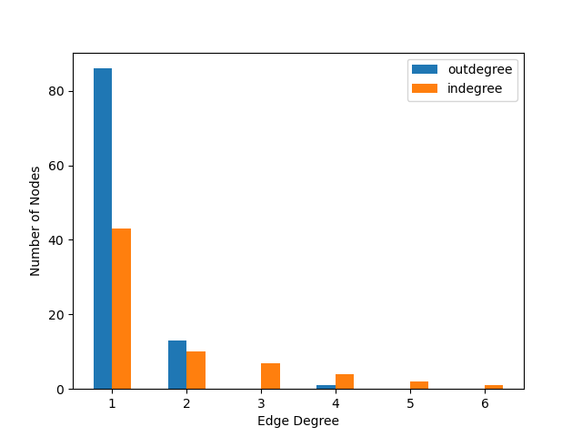
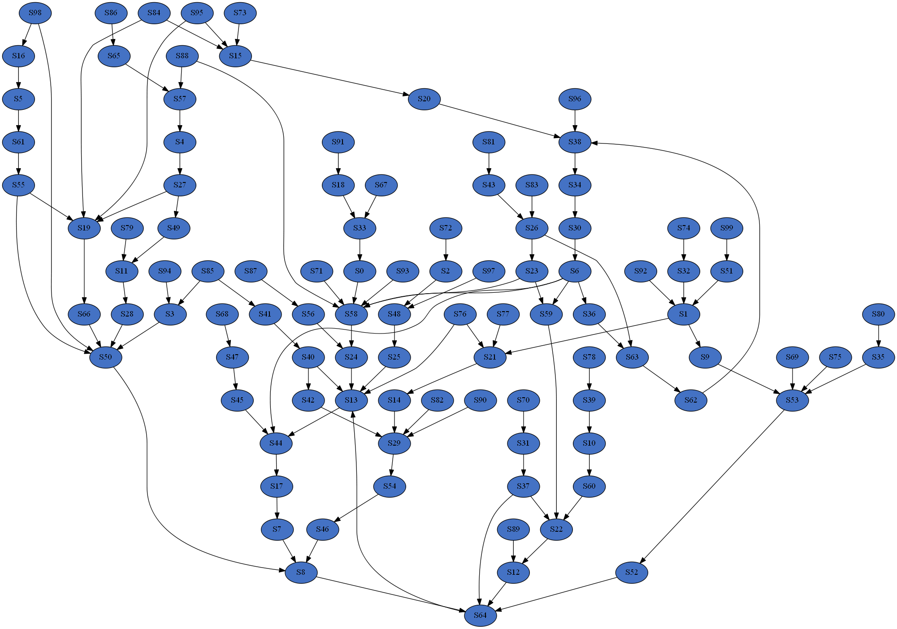

# SBbadger
**SBbadger** is a Python library for the generation of synthetic, directed, reaction networks that conform to 
user-defined degree distributions. 

Quick Start
===========

Installation
------------

Supported versions of Python are 3.7, 3.8, and 3.9. Python dependencies include numpy, scipy, antimony, matplotlib,
and pydot. An additional dependency for pydot is either a system installation of Graphviz or pydot installation
via conda.

SBbadger can be installed using pip:

```
$ pip install SBbadger
```

Simple Example
--------------

In the simplest possible case SBbadger can generate a single, 10 species, 
random network using the following commands in the python interpreter:

```
>>> from SBbadger import generate
>>> generate.models()
```

In this case, SBbadger will randomly select reactions from 4 possible reaction types
and randomly select the reactants and products for those reactions from the 10 species.
The possible reaction types are:

| Reaction Type | Default Probabilities | Examples       |
|---------------|:----------------------|:---------------|
| UNI-UNI       | 0.35                  | A -> B         |
| BI-UNI        | 0.3                   | A + B -> C     | 
| UNI-BI        | 0.3                   | A -> B + C     | 
| BI-BI         | 0.05                  | A + B -> C + D |

The default reaction probabilities are adjustable. Also note that the same species can be
chosen more than once in a reaction, for example A + A -> B is a valid reaction. Reactions 
will continue to be added to the network until all 10 species have included. Below is the 
depiction of a sample network and an Antimony string describing the associated model:


```
var S0, S1, S9
ext S2, S3, S4, S5, S6, S7, S8

J0: S8 -> S0; kc0*S8
J1: S6 -> S5 + S0; kc1*S6
J2: S2 + S1 -> S9; kc2*S2*S1
J3: S7 -> S1 + S5; kc3*S7
J4: S9 + S0 -> S1 + S4; kc4*S9*S0
J5: S6 -> S3; kc5*S6

kc0 = 0.10285116762815472
kc1 = 65.21087405102236
kc2 = 34.220083386257116
kc3 = 11.526991028714853
kc4 = 0.15553486234310213
kc5 = 4.977089372937806

S2 = 4.759074353180305
S3 = 1.666194306431944
S4 = 7.110932299198714
S5 = 6.803821600602985
S6 = 9.329699040726386
S7 = 7.7760175494627735
S8 = 9.74931761300573

S0 = 3.431293190721635
S1 = 5.5106455586766545
S9 = 7.631625970757748
```
	
``var`` and ``ext`` denote floating and boundary species respectively. The default 
rate law is mass action with all parameters randomly selected from a log-uniform 
distribution with a range from 0.001 to 100. Initial conditions are randomly selected
from a uniform distribution with a range from 0 to 10. By default, the reactions are 
irreversible.

Expanded Example
----------------

Now suppose we want to create many models, and with more defined properties. The following python
script will do just that.

    from SBbadger import generate
    from scipy.stats import zipf

    def in_dist(k):
        return k ** (-2)

    def out_dist(k):
        return zipf.pmf(k, 3)

    if __name__ == "__main__":

        generate.models(
			group_name="extended_example",
			n_models=10,
			n_species=100,
			in_dist=in_dist,
			out_dist=out_dist,
			min_freq=1.0,
			n_cpus=4
			)
			
Two distribution functions are defined, ``in_dist`` and ``out_dist``, for the in-edge and out-edge distributions respectively where ``k`` is the degree. Both are power law functions. SBbadger will discretize, truncate, and renormalize these functions.
Note that ``in_dist`` is defined explicitly but ``out_dist`` is a wrapper around the Scipy function ``zipf``. A short description of the other parameters follows:

* ``group_name``: prepended to all files and the name of the directory where those files will be deposited. 
* ``n_models``: The number of models to be produced.
* ``n_species``: The number of nodes/species per model.
* ``min_freq``: The minimum expected frequency of nodes in every bin. This parameter, along with the number of species, is used to determine where to truncate the distribution.
* ``n_cpus``: The number of cores to run in parallel. Note that ``if __name__ == "__main__":`` is necessary to use multiprocessing on Windows.

In the above example 10 models will be produced, each with 100 species; the in-edge and out-edge distributions will both follow a power law but with different exponents; the distributions will be truncated such that every degree bin will have a minimum expected node count of 1; and the models will be split into 4 groups to be processed in parallel. Below are examples of the resulting distributions and a network.



